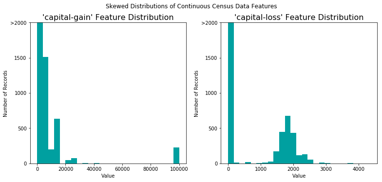
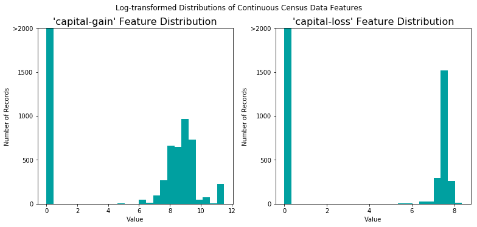
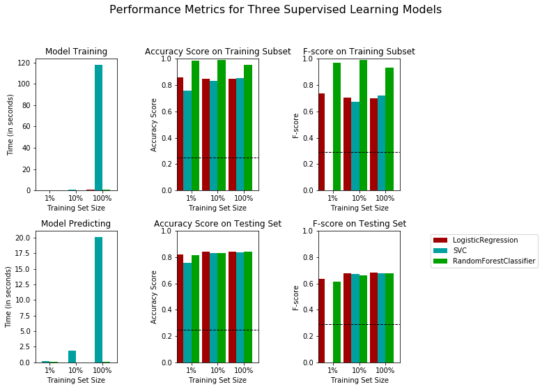
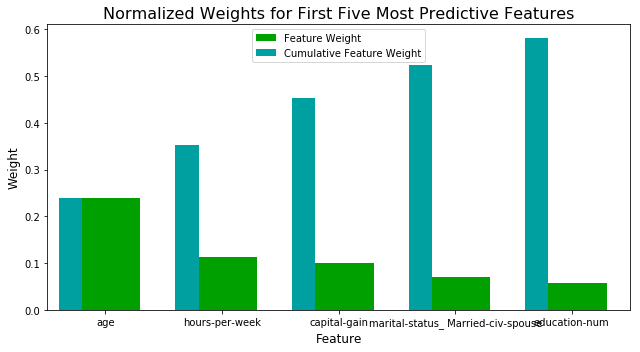

# Project: Finding Donors

# Table of Contents
- [Project Description](#project-description)
- [Environment and Programming language](#environment-and-programming-language)
- [Data Description](#data-description)
- [Exploratory Data Analysis](#exploratory-data-analysis)
  * [Reading the Data](#reading-the-data)
  * [Data Exploration](#data-exploration)
  * [Dataset Preparation](#dataset-preparation)
    + [Transforming Skewed Continuous Features](#transforming-skewed-continuous-features)
    + [Normalizing Numerical Features](#normalizing-numerical-features)
    + [Data Pre-processing](#data-pre-processing)
    + [Shuffle and Split Data](#shuffle-and-split-data)
- [Evaluating Model Performance](#evaluating-model-performance)
  * [Metrics and the Naive Predictor](#metrics-and-the-naive-predictor)
    + [Accuracy, Precision, Recall](#accuracy--precision--recall)
  * [Naive Predictor Performance](#naive-predictor-performance)
  * [Model Application](#model-application)
    + [Supervised Learning Models](#supervised-learning-models)
  * [Model Selection](#model-selection)
  * [Creating a Training and Predicting Pipeline](#creating-a-training-and-predicting-pipeline)
  * [Initial Model Evaluation](#initial-model-evaluation)
- [Improving the Results](#improving-the-results)
  * [Describing the Model in Layman's Terms](#describing-the-model-in-layman-s-terms)
  * [Model Tuning](#model-tuning)
- [Feature Importance](#feature-importance)
  * [Feature Relevance Observation](#feature-relevance-observation)
- [Feature Selection](#feature-selection)
  * [Effect of Feature Selection](#effect-of-feature-selection)

## Project Description
In this project, I will employ several supervised algorithms of choice to accurately model individual's income using data collected from the 1994 U.S. Census. I will then choose the best candidate algorithm from preliminary results and further optimize this algorithm to best model the data. Goal with this implementation is to construct a model that accurately predicts whether an individual makes more than $50,000. This sort of task can arise in a non-profit setting, where organizations survive on donations. Understanding an individual's income can help a non-profit better understand how large of a donation to request, or whether or not they should reach out to begin with. While it can be difficult to determine an individual's general income bracket directly from public sources, we can (as we will see) infer this value from other publically available features.

## Environment and Programming language
* Python 2.7.14 has been used.
* Miniconda framework has been used which can be downloaded from this [link](https://repo.continuum.io/miniconda/).
* Once installed, open conda prompt.
* Create virtual environment by using `conda env create -f environment.yaml`. [**environment.yaml**](./environment.yaml) has been included in the repository.
* Jupyter notebook has been used for interactively analyzing and exploring the data.
* Python code and calculation given in the [Notebook file](./finding_donors.ipynb) file.
* [Dataset](./census.csv) is given as **.csv** file.
* We are going to use [helper file](./visuals.py). This file contains following 3 functions:
  1. `distribution(data, transformed = False)`: Visualization code for displaying skewed distributions of features. We can use transformation like log transformation on the data while visualizing.
  2. `evaluate(results, accuracy, f1)`: Visualization code to display results of various learners.
  3. `feature_plot(importances, X_train, y_train)`: Display the five most important features.

## Data Description
The dataset for this project originates from the [UCI Machine Learning Repository](https://archive.ics.uci.edu/ml/datasets/Census+Income). The datset was donated by Ron Kohavi and Barry Becker, after being published in the article _"Scaling Up the Accuracy of Naive-Bayes Classifiers: A Decision-Tree Hybrid"_. You can find the article by Ron Kohavi [online](https://www.aaai.org/Papers/KDD/1996/KDD96-033.pdf). The data we investigate here consists of small changes to the original dataset, such as removing the `'fnlwgt'` feature and records with missing or ill-formatted entries.

## Exploratory Data Analysis
The last column from this dataset, 'income', will be our target label (whether an individual makes more than, or at most, $50,000 annually). All other columns are features about each individual in the census database.
### Reading the Data
**pandas read_csv()** function is used to read the data.
### Data Exploration
A cursory investigation of the dataset will determine how many individuals fit into either group, and will tell us about the percentage of these individuals making more than $50,000.

Following are the observations:
* Total number of records: 45222.
* Individuals making more than $50,000: 11208.
* Individuals making at most $50,000: 34014.
* Percentage of individuals making more than $50,000: 24%.

**We have following features in the dataset:**
* **age**: continuous.
* **workclass**: Private, Self-emp-not-inc, Self-emp-inc, Federal-gov, Local-gov, State-gov, Without-pay, Never-worked.
* **education**: Bachelors, Some-college, 11th, HS-grad, Prof-school, Assoc-acdm, Assoc-voc, 9th, 7th-8th, 12th, Masters, 1st-4th, 10th, Doctorate, 5th-6th, Preschool.
* **education-num**: continuous.
* **marital-status**: Married-civ-spouse, Divorced, Never-married, Separated, Widowed, Married-spouse-absent, Married-AF-spouse.
* **occupation**: Tech-support, Craft-repair, Other-service, Sales, Exec-managerial, Prof-specialty, Handlers-cleaners, Machine-op-inspct, Adm-clerical, Farming-fishing, Transport-moving, Priv-house-serv, Protective-serv, Armed-Forces.
* **relationship**: Wife, Own-child, Husband, Not-in-family, Other-relative, Unmarried.
* **race**: Black, White, Asian-Pac-Islander, Amer-Indian-Eskimo, Other.
* **sex**: Female, Male.
* **capital-gain**: continuous.
* **capital-loss**: continuous.
* **hours-per-week**: continuous.
* **native-country**: United-States, Cambodia, England, Puerto-Rico, Canada, Germany, Outlying-US(Guam-USVI-etc), India, Japan, Greece, South, China, Cuba, Iran, Honduras, Philippines, Italy, Poland, Jamaica, Vietnam, Mexico, Portugal, Ireland, France, Dominican-Republic, Laos, Ecuador, Taiwan, Haiti, Columbia, Hungary, Guatemala, Nicaragua, Scotland, Thailand, Yugoslavia, El-Salvador, Trinadad&Tobago, Peru, Hong, Holand-Netherlands.

### Dataset Preparation
Before data can be used as input for machine learning algorithms, it often must be cleaned, formatted, and restructured — this is typically known as **preprocessing**. Fortunately, for this dataset, there are no invalid or missing entries we must deal with, however, there are some qualities about certain features that must be adjusted. This pre-processing can help tremendously with the outcome and predictive power of nearly all learning algorithms.

#### Transforming Skewed Continuous Features
A dataset may sometimes contain at least one feature whose values tend to lie near a single number, but will also have a non-trivial number of vastly larger or smaller values than that single number.  Algorithms can be sensitive to such distributions of values and can underperform if the range is not properly normalized. With the census dataset two features fit this description: '`capital-gain'` and `'capital-loss'`.

**We can see following plot:**

For highly-skewed feature distributions such as `'capital-gain'` and `'capital-loss'`, it is common practice to apply a <a href="https://en.wikipedia.org/wiki/Data_transformation_(statistics)">logarithmic transformation</a> on the data so that the very large and very small values do not negatively affect the performance of a learning algorithm. Using a logarithmic transformation significantly reduces the range of values caused by outliers. Care must be taken when applying this transformation however: The logarithm of `0` is undefined, so we must translate the values by a small amount above `0` to apply the logarithm successfully.

**Following is the plot after performing log transformation.**

#### Normalizing Numerical Features
In addition to performing transformations on features that are highly skewed, it is often good practice to perform some type of scaling on numerical features. Applying a scaling to the data does not change the shape of each feature's distribution (such as `'capital-gain'` or `'capital-loss'` above); however, normalization ensures that each feature is treated equally when applying supervised learners. Note that once scaling is applied, observing the data in its raw form will no longer have the same original meaning, as exampled below.

We will use `sklearn.preprocessing.MinMaxScaler()` function from the sklearn library.

#### Data Pre-processing
From the table in **Exploring the Data** above, we can see there are several features for each record that are non-numeric. Typically, learning algorithms expect input to be numeric, which requires that non-numeric features (called *categorical variables*) be converted. One popular way to convert categorical variables is by using the **one-hot encoding** scheme. One-hot encoding creates a _"dummy"_ variable for each possible category of each non-numeric feature. For example, assume `someFeature` has three possible entries: `A`, `B`, or `C`. We then encode this feature into `someFeature_A`, `someFeature_B` and `someFeature_C`.

|   | someFeature |    | someFeature_A | someFeature_B | someFeature_C |
| :---: | :---: | :--:         | :-: | :-: | :-: |
| 0 |  B  |  | 0 | 1 | 0 |
| 1 |  C  | ----> one-hot encode ----> | 0 | 0 | 1 |
| 2 |  A  |  | 1 | 0 | 0 |

Additionally, as with the non-numeric features, we need to convert the non-numeric target label, `'income'` to numerical values for the learning algorithm to work. Since there are only two possible categories for this label ("<=50K" and ">50K"), we can avoid using one-hot encoding and simply encode these two categories as `0` and `1`, respectively.

We will use `pandas.get_dummies()` function for to perform one-hot encoding on the `'features_log_minmax_transform'` data.

We will also convert the target label `'income_raw'` to numerical entries. We will set records with "<=50K" to `0` and records with ">50K" to `1`.

**After one hot encoding we have 103 total features.**

#### Shuffle and Split Data
Now all _categorical variables_ have been converted into numerical features, and all numerical features have been normalized. As always, we will now split the data (both features and their labels) into training and test sets. 80% of the data will be used for training and 20% for testing.

**We will use `sklearn.model_selection.train_test_split()` function for this.** We have following number of samples in training and testing set after train test split.
* Training set has 36177 samples.
* Testing set has 9045 samples.

## Evaluating Model Performance
In this section, we will investigate four different algorithms, and determine which is best at modeling the data. Three of these algorithms will be supervised learners of your choice, and the fourth algorithm is known as a *naive predictor*.

### Metrics and the Naive Predictor
*CharityML*, equipped with their research, knows individuals that make more than \$50,000 are most likely to donate to their charity. Because of this, *CharityML* is particularly interested in predicting who makes more than \$50,000 accurately. It would seem that using **accuracy** as a metric for evaluating a particular model's performace would be appropriate. Additionally, identifying someone that *does not* make more than \$50,000 as someone who does would be detrimental to *CharityML*, since they are looking to find individuals willing to donate. Therefore, a model's ability to precisely predict those that make more than \$50,000 is *more important* than the model's ability to **recall** those individuals. We can use **F-beta score** as a metric that considers both precision and recall:

In particular, when  more emphasis is placed on precision. This is called the  score (or F-score for simplicity).

Looking at the distribution of classes (those who make at most \$50,000, and those who make more), it's clear most individuals do not make more than \$50,000. This can greatly affect **accuracy**, since we could simply say *"this person does not make more than \$50,000"* and generally be right, without ever looking at the data! Making such a statement would be called **naive**, since we have not considered any information to substantiate the claim. It is always important to consider the *naive prediction* for your data, to help establish a benchmark for whether a model is performing well. That been said, using that prediction would be pointless: If we predicted all people made less than \$50,000, *CharityML* would identify no one as donors.

#### Accuracy, Precision, Recall

** Accuracy ** measures how often the classifier makes the correct prediction. It’s the ratio of the number of correct predictions to the total number of predictions (the number of test data points).

** Precision ** tells us what proportion of messages we classified as spam, actually were spam.
It is a ratio of true positives(words classified as spam, and which are actually spam) to all positives(all words classified as spam, irrespective of whether that was the correct classification), in other words it is the ratio of

`[True Positives/(True Positives + False Positives)]`

** Recall(sensitivity)** tells us what proportion of messages that actually were spam were classified by us as spam.
It is a ratio of true positives(words classified as spam, and which are actually spam) to all the words that were actually spam, in other words it is the ratio of

`[True Positives/(True Positives + False Negatives)]`

For classification problems that are skewed in their classification distributions like in our case, for example if we had a 100 text messages and only 2 were spam and the rest 98 weren't, accuracy by itself is not a very good metric. We could classify 90 messages as not spam(including the 2 that were spam but we classify them as not spam, hence they would be false negatives) and 10 as spam(all 10 false positives) and still get a reasonably good accuracy score. For such cases, precision and recall come in very handy. These two metrics can be combined to get the F1 score, which is weighted average(harmonic mean) of the precision and recall scores. This score can range from 0 to 1, with 1 being the best possible F1 score(we take the harmonic mean as we are dealing with ratios).

### Naive Predictor Performance
If we chose a model that always predicted an individual made more than $50,000, then following is the model's accuracy and F-score be on this dataset:

**Naive Predictor: [Accuracy score: 0.2478, F-score: 0.2917]**

* When we have a model that always predicts '1' (i.e. the individual makes more than 50k) then our model will have no True Negatives(TN) or False Negatives(FN) as we are not making any negative('0' value) predictions. Therefore our Accuracy in this case becomes the same as our **Precision`(True Positives/(True Positives + False Positives))`** as every prediction that we have made with value '1' that should have '0' becomes a False Positive; therefore our denominator in this case is the total number of records we have in total.
* Our **Recall score`(True Positives/(True Positives + False Negatives))`** in this setting becomes 1 as we have no False Negatives.

### Model Application

#### Supervised Learning Models
**Following are some of the supervised learning models that are currently available in** [`scikit-learn`](http://scikit-learn.org/stable/supervised_learning.html) **that you may choose from:**
- Gaussian Naive Bayes (GaussianNB)
- Decision Trees
- Ensemble Methods (Bagging, AdaBoost, Random Forest, Gradient Boosting)
- K-Nearest Neighbors (KNeighbors)
- Stochastic Gradient Descent Classifier (SGDC)
- Support Vector Machines (SVM)
- Logistic Regression

### Model Selection
We don't know whether data is linearly separable or not. So I propose to use one linear classifier and two non-linear classifier.
1. Logistic Regression
2. Random Forest
3. Support vector machine

Following are the detailed information of each of the above mentioned classifiers.

**Logistics Regression**

1. Real world Application : Loan prediction
2. Strengths of the model : Simple, Easy to implement.
3. Weakness of the modes : Overfitting in case of number of features are larger than number of training points, assumes features are independent of each other.
4. Reasoning behind selection of this model : This is one of the simple model available. This is linear model and can give us idea about overall data linearity. This is the good starting point.

**Random Forest**

1. Real world Application : Loan prediction
2. Strengths of the model : Reduction in overfitting as compared to Decision Trees. More accurate than decision trees.
3. Weakness of the modes : Slow real time prediction. Difficult to implement and complex.
4. Reasoning behind selection of this model : We have 36177 samples in training data so we can use high variance classifier and random forest can be a good candidate because it can provide good accuracy at the same reduces variance or overfitting.

**Support Vector Machines**

1. Real world Application : Financial analysis
2. Strengths of the model : Efective in high dimensional spaces. Memory efficient because it uses subset of training functions for decision function. Kernel functions provide non-linear decision boundaries.
3. Weakness of the modes : SVM doesn't directly provide probability estimates.
4. Reasoning behind selection of this model : We have 103 features which makes it high dimensional problem. So SVM is a good candidate to use in this case.

### Creating a Training and Predicting Pipeline
To properly evaluate the performance of each model I've chosen, it's important that I create a training and predicting pipeline that allows you to quickly and effectively train models using various sizes of training data and perform predictions on the testing data.

Following are the steps of the pipeline:
- Import `fbeta_score` and `accuracy_score` from [`sklearn.metrics`](http://scikit-learn.org/stable/modules/classes.html#sklearn-metrics-metrics).
- Fit the learner to the sampled training data and record the training time.
- Perform predictions on the test data `X_test`, and also on the first 300 training points `X_train[:300]`.
  - Record the total prediction time.
- Calculate the accuracy score for both the training subset and testing set.
- Calculate the F-score for both the training subset and testing set.
  - Make sure to set the `beta` parameter!

We will use function `train_predict(learner, sample_size, X_train, y_train, X_test, y_test)` for the pipeline implementation.

### Initial Model Evaluation
- Import the three supervised learning models we've discussed in the previous section.
- Initialize the three models and store them in `'clf_A'`, `'clf_B'`, and `'clf_C'`.
  - Use a `'random_state'` for each model you use, if provided.
  - **Note:** Use the default settings for each model — we will tune one specific model in a later section.
- Calculate the number of records equal to 1%, 10%, and 100% of the training data.
  - Store those values in `'samples_1'`, `'samples_10'`, and `'samples_100'` respectively.

**Following is the result of the initial model evaluation**

## Improving the Results
In this section, we will choose from the three supervised learning models the *best* model to use on the student data. We will then perform a grid search optimization for the model over the entire training set (`X_train` and `y_train`) by tuning parameters upon the un-tuned model's F-score.

From the plot given above, Logistics regression is best performing classifier in our scenarios. Following are the reasons of the same :

1. Logistics regression has highest accuracy and F-score on testing set considering all 1%, 10% and 100% training sizes.
2. Logistics regression have lowest training and prediction time as compared to SVM.
3. With the available data of 36177 examples and 103 features, Logistics regression can perform well and will not overfit the data.
4. Given is binary classification so Logistic regression is a good classifier to be used when only 2 classes are there.

### Describing the Model in Layman's Terms
Logistic regression is a classification technique in machine learning.

To understand Logistic regression, first we need to understand what is regression. Regression is a technique to establish a relationship between input variables and output. Here input variables are called features or independent variables and output variable is called dependent variable. This relationship between dependent and independent variables can be linear or non-linear.

We can have 2 types of dependent variable.

1. Continuous : These are continuous values like age, income, etc. When dependent variable is continuous then it can take any value. Technique of finding the linear relationship among independent variables which produce continuous output is called linear regression.
2. Discrete : When dependent variable is descrete like "true/false", "yes/no", etc which can take only some values which are not continuous then this becomes classification problem. Values which dependent variable can take are called classes. For linear dependence between dependent and independent variable, we use logistic regression.

**Training in Logistic regression**

Logistic regression training is all abount the finding the relationship between independent variables or features to the class. Logistic regression tries to find which class is most likely to occur for the given values of fatures. This is done by finding the probability.

Probability can have values between 0 to 1. 0 denotes no possibility of that class or phenomenon, for example, probability of sun rising in the west is zero which can never occur. Probability value of 1 gives 100% certainity about any phenomenon, for example, probabiliuty of sun rising in the east is always 1.

When we have multiple phenomenon or classes then probability can be in between 0 and 1 also.

In our example we have 2 classes, that is, individual income ">50K" and "<=50K". So these are 2 classes. We have various independent variables or features like age, occupation, education, education number, etc. Some of the features affect income more and some of the features affect income less like with age it is higher probability of increased income or with higher level of education one has higher probaility of earning higher income.

While training for the logistic regreassion, we tries to establish a relationship between all features and income to find the probability whether probability of income ">50K" is higher than income "<=50K" or vice-versa.

This relationship gives us a model or an mathematical relationship which calculates the probability of income level as per given values of feature variables.

Usually logistic regression is used for binary classification which means output variable contains only 2 classes like "yes/no", "true/false", etc but that can be extended to use logistic regression to classify data to more than 2 classes.

**Prediction in Logistic regression**

After training once we find the relationship between features and classes, we can use that relationship to predict the class on the basis of probability calculation for the values of various features.

Here we can have some values for the given features like age, education, education number, occupation, etc and on the bsis of relationship created by training of the logistic regression model, we find whether probability of income ">50K" is higher than income "<=50K" or not. Higher probability class will be the output of the relationship.

### Model Tuning
Following steps will be used for model tuning:
- Import [`sklearn.model_selection.GridSearchCV`](https://scikit-learn.org/stable/modules/generated/sklearn.model_selection.GridSearchCV.html) and [`sklearn.metrics.make_scorer`](http://scikit-learn.org/stable/modules/generated/sklearn.metrics.make_scorer.html).
- Initialize the classifier you've chosen and store it in `clf`.
 - Set a `random_state` if one is available to the same state you set before.
- Create a dictionary of parameters you wish to tune for the chosen model.
 - Example: `parameters = {'parameter' : [list of values]}`.
 - **Note:** Avoid tuning the `max_features` parameter of your learner if that parameter is available!
- Use `make_scorer` to create an `fbeta_score` scoring object (with $\beta = 0.5$).
- Perform grid search on the classifier `clf` using the `'scorer'`, and store it in `grid_obj`.
- Fit the grid search object to the training data (`X_train`, `y_train`), and store it in `grid_fit`.

**Following is the result of the model optimization:**

|     Metric     | Unoptimized Model | Optimized Model |
| :------------: | :---------------: | :-------------: |
| Accuracy Score |    0.8419         | 0.8420          |
| F-score        |    0.6832         | 0.6842          |

1. Optimized accuracy and F-score on the testing data are 0.8420 and 0.6842 respectively.
2. These scores are little bit better than the un-optimized model.
3. Naive predictor benchmark accuracy and F-scores were 0.2478, 0.2917 respectively and optimized model has far better accuracy and F-scores as compared to benchmark Naive Predictors.

## Feature Importance
An important task when performing supervised learning on a dataset like the census data we study here is determining which features provide the most predictive power. By focusing on the relationship between only a few crucial features and the target label we simplify our understanding of the phenomenon, which is most always a useful thing to do. In the case of this project, that means we wish to identify a small number of features that most strongly predict whether an individual makes at most or more than \$50,000.

### Feature Relevance Observation
When **Exploring the Data**, it was shown there are thirteen available features for each individual on record in the census data. So we will choose 5 features which are most important for prediction as seen by model which includes feature importance like Random Forest classifier.

I have used `sklearn.ensemble.RandomForestClassifier()` to get the top 5 most important features.

**Following is the plot of the same**

## Feature Selection
We can use top 5 features to fit the model instead of using all the features. Following is the result of the model accuracy and F-score with reduced features model:

|     Metric     | Full Feature Model | Reduced Feature Model |
| :------------: | :---------------: | :-------------: |
| Accuracy Score |    0.8420         | 0.8271          |
| F-score        |    0.6842         | 0.6499          |

### Effect of Feature Selection
1. Reduced data model is less accurate as it has less accuracy and less F-score as compared to model trained on full data.

2. If training time was a factor then definitely model with reduced data will be considered because it will be more efficient and sometimes can be more accurate. Less number of features also reduces the probability of overfitting so model generalizes well. This also reduces the complexity of the model.
